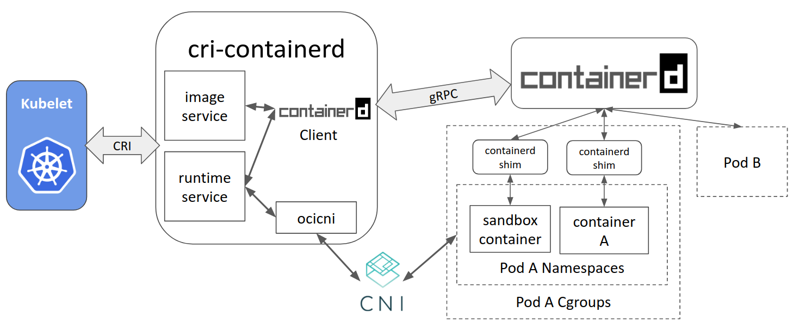

# 🧪 CRI Lab – Container Runtime Interface Exploration with Kind

This lab will help you understand how Kubernetes interacts with container runtimes via the **Container Runtime Interface (CRI)**. We will use the existing **Kind cluster** created in the CNI lab and inspect container runtime information.

---

## 🌟 Objectives

* Understand what the Container Runtime Interface (CRI) is
* Detect the container runtime used in the cluster
* Observe how pods map to runtime containers
* Explore container metadata with `crictl` (optional)

---

## 🛠️ Prerequisites

* A running Kind cluster (from the CNI lab)

## 🚀 Step 1: Verify the Cluster and Runtime Info

Make sure your cluster is running:

```bash
kubectl cluster-info
```

Check the runtime used by the nodes:

```bash
kubectl get nodes -o jsonpath="{.items[*].status.nodeInfo.containerRuntimeVersion}"
```

Expected output (on Kind):

```
containerd://2.0.3
```

---

## 📄 Step 2: Deploy a Sample Pod

```bash
kubectl run demo --image=busybox --restart=Never -- sleep 3600
kubectl get pods -o wide
```

Take note of the pod name, node, and IP address.

---

## 🔍 Step 3: Enter the Kind Control Plane Node

Get the Docker container name for the Kind node:

```bash
docker ps --format '{{.Names}}' | grep <node-name>
```

Then open a shell inside the container:

```bash
docker exec -it <node-name> bash
```

Inside, check for containerd socket:

```bash
ls /run/containerd/containerd.sock
```

---

## 🔧 Step 4 (Optional): Use `crictl` to Inspect the Runtime

> Note: `crictl` may not be pre-installed in Kind and configured. 

<details>
<summary>Click to install and configure `crictl`</summary>
To install:

```bash
apt update && apt install -y curl
curl -LO https://github.com/kubernetes-sigs/cri-tools/releases/download/v1.28.0/crictl-v1.28.0-linux-amd64.tar.gz
sudo tar zxvf crictl-v1.28.0-linux-amd64.tar.gz -C /usr/local/bin
```

Configure it:

```bash
echo "runtime-endpoint: unix:///run/containerd/containerd.sock" > /etc/crictl.yaml
```
</details>

### 🔍 Explore with `crictl`

List pods and containers:

```bash
crictl pods
crictl ps -a
```

Inspect container details:

```bash
crictl inspect <container-id>
```

Get container stats:

```bash
crictl stats
```

---

## 🌈 Step 5: Understand the CRI Architecture

Use a diagram to visualize:

* `kubelet` ↔️ `containerd` via gRPC
* `/run/containerd/containerd.sock`
* Kubernetes only talks to container runtime via CRI, not Docker directly


> The Container Runtime Interface (CRI) is a standardized API that allows Kubernetes to interact with container runtimes. It abstracts the details of the runtime, enabling Kubernetes to manage containers without being tied to a specific implementation.
> The CRI allows Kubernetes to work with different container runtimes like `containerd`, `CRI-O`, and others, providing a consistent interface for managing containers.
> The CRI is implemented by the `kubelet`, which communicates with the container runtime using gRPC over a Unix socket (e.g., `/run/containerd/containerd.sock`).
> The CRI provides a set of APIs for managing container lifecycle, image management, and runtime configuration.


This abstraction allows swapping runtimes (e.g., containerd, CRI-O).

---

## 📅 Step 6: Clean Up

```bash
kubectl delete pod demo
```

> The cluster can be reused for future labs.

---

## ✅ Checklist

* [ ] Verified runtime version via `kubectl`
* [ ] Deployed and observed a sample pod
* [ ] Explored the runtime environment from inside the node
* [ ] Used `crictl` to list and inspect containers (optional)

---

## 💬 What’s Next?

You now understand how Kubernetes interacts with the container runtime using the CRI. In a future lab, you will explore **CSI** to understand how Kubernetes handles storage provisioning.
