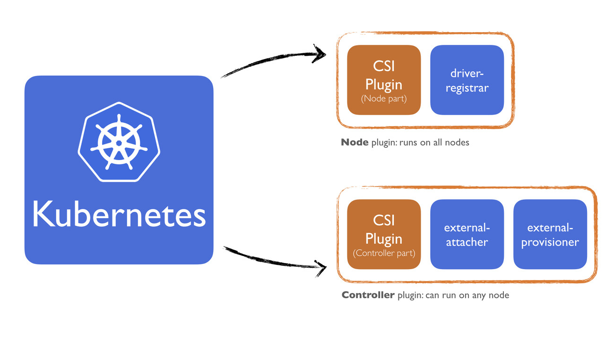

# 🧪 CSI Lab – Kubernetes Storage with Static & Dynamic Provisioning (Kind)

This lab introduces the Container Storage Interface (CSI) in Kubernetes through two stages:

1. **Static provisioning** using `hostPath` volumes
2. **Dynamic provisioning** using the official **HostPath CSI driver**

> 🚀 Reuses the `cni-lab` Kind cluster from previous labs.

---

## 🌟 Objectives

* Understand CSI and its role in Kubernetes
* Perform **static provisioning** with a manually defined PersistentVolume
* Install a lightweight **CSI driver** (HostPath)
* Perform **dynamic provisioning** using a StorageClass

---

## 🚀 Part 1: Static Provisioning (hostPath)

### Step 1.1: Create a PersistentVolume (PV)

```bash
mkdir -p /tmp/k8s-csi-lab
```

**pv-hostpath.yaml**:

```yaml
apiVersion: v1
kind: PersistentVolume
metadata:
  name: hostpath-pv
spec:
  capacity:
    storage: 1Gi
  accessModes:
    - ReadWriteOnce
  hostPath:
    path: "/tmp/k8s-csi-lab"
  persistentVolumeReclaimPolicy: Retain
```

```bash
kubectl apply -f pv-hostpath.yaml
```

### Step 1.2: Create a PersistentVolumeClaim (PVC)

**pvc.yaml**:

```yaml
apiVersion: v1
kind: PersistentVolumeClaim
metadata:
  name: hostpath-pvc
spec:
  accessModes:
    - ReadWriteOnce
  resources:
    requests:
      storage: 500Mi
```

```bash
kubectl apply -f pvc.yaml
```

Ensure it binds:

```bash
kubectl get pvc
```

### Step 1.3: Attach PVC to a Pod

**pod-with-pvc.yaml**:

```yaml
apiVersion: v1
kind: Pod
metadata:
  name: csi-demo-pod
spec:
  containers:
  - name: busybox
    image: busybox
    command: ["sh", "-c", "while true; do sleep 3600; done"]
    volumeMounts:
    - mountPath: "/data"
      name: csi-volume
  volumes:
  - name: csi-volume
    persistentVolumeClaim:
      claimName: hostpath-pvc
```

```bash
kubectl apply -f pod-with-pvc.yaml
```

### Step 1.4: Test Persistence

```bash
kubectl exec -it csi-demo-pod -- sh -c "echo 'Hello from CSI' > /data/test.txt && cat /data/test.txt"
kubectl delete pod csi-demo-pod
kubectl apply -f pod-with-pvc.yaml
kubectl exec -it csi-demo-pod -- cat /data/test.txt
```

---

## ⚙️ Part 2: Dynamic Provisioning with HostPath CSI Driver

### Step 2.1: Install the HostPath CSI Driver

```bash
kubectl apply -k "https://github.com/kubernetes-csi/csi-driver-host-path/deploy/kubernetes-1.25/?ref=v1.10.0"
```

Wait until pods are ready:

```bash
kubectl get pods -n hostpath-csi
```

### Step 2.2: Create a Dynamic StorageClass

**storageclass.yaml**:

```yaml
apiVersion: storage.k8s.io/v1
kind: StorageClass
metadata:
  name: csi-hostpath-sc
provisioner: hostpath.csi.k8s.io
volumeBindingMode: WaitForFirstConsumer
```

```bash
kubectl apply -f storageclass.yaml
```

### Step 2.3: Create a PVC with StorageClass

**pvc-dynamic.yaml**:

```yaml
apiVersion: v1
kind: PersistentVolumeClaim
metadata:
  name: csi-dynamic-pvc
spec:
  accessModes:
    - ReadWriteOnce
  resources:
    requests:
      storage: 1Gi
  storageClassName: csi-hostpath-sc
```

```bash
kubectl apply -f pvc-dynamic.yaml
kubectl get pvc
```

### Step 2.4: Deploy a Pod Using Dynamic PVC

**pod-dynamic.yaml**:

```yaml
apiVersion: v1
kind: Pod
metadata:
  name: dynamic-csi-pod
spec:
  containers:
  - name: alpine
    image: alpine
    command: ["sh", "-c", "while true; do sleep 3600;"]
    volumeMounts:
    - mountPath: "/data"
      name: dynamic-vol
  volumes:
  - name: dynamic-vol
    persistentVolumeClaim:
      claimName: csi-dynamic-pvc
```

```bash
kubectl apply -f pod-dynamic.yaml
```

Test writing:

```bash
kubectl exec -it dynamic-csi-pod -- sh -c "echo 'Dynamic CSI working' > /data/hello.txt && cat /data/hello.txt"
```

---

## 🖼️ CSI Architecture Diagram (Dynamic Provisioning)



> * `kubelet` talks to the CSI driver via sockets
> * CSI controller & node plugins handle PV/PVC provisioning
> * The external-provisioner automates PV creation

---

## 🧹 Clean Up

```bash
kubectl delete pod dynamic-csi-pod
kubectl delete pvc csi-dynamic-pvc
kubectl delete sc csi-hostpath-sc
kubectl delete -k "https://github.com/kubernetes-csi/csi-driver-host-path/deploy/kubernetes-1.25/?ref=v1.10.0"

kubectl delete -f pod-with-pvc.yaml
kubectl delete -f pvc.yaml
kubectl delete -f pv-hostpath.yaml
rm -rf /tmp/k8s-csi-lab
```

---

## ✅ Checklist

* [ ] Performed static provisioning with hostPath
* [ ] Installed HostPath CSI driver
* [ ] Created a StorageClass and PVC for dynamic provisioning
* [ ] Mounted PVC to a pod and validated persistence
* [ ] Reviewed CSI architecture diagram
* [ ] Cleaned up all resources

---

## 💬 What's Next?

You're now equipped to understand both static and dynamic CSI usage in Kubernetes. Future labs may explore real-world drivers like AWS EBS or Longhorn in cloud or VM environments.
